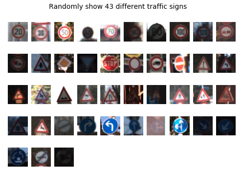
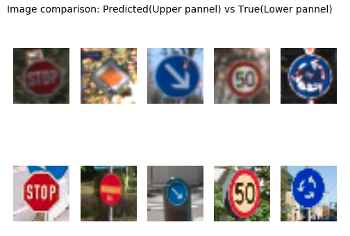

##  The traffic sign classifier project pipeline:
[Solution](Traffic_Sign_Classifier.ipynb)
* Data process, such as mean subtraction, normalization, edge sharpening
* Data augmentation
* Build neural network (NN) in Tensorflow
* Training and evaluate NN using the AWS GPU
* Test and analyze the NN on testing data

